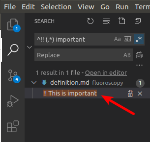
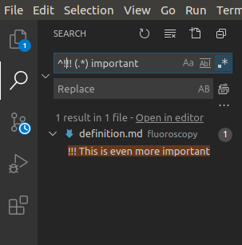
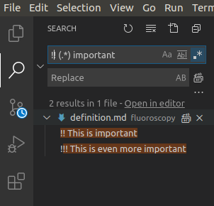
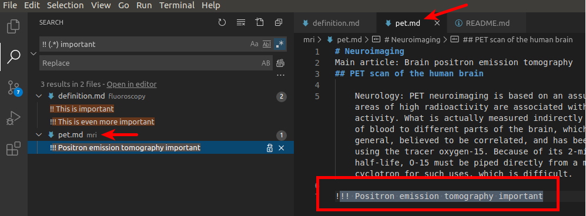

# radio-med-files
Sample project for radiology medical files 

To search in files for important concepts:

1. Go in search bar
2. Enter ^!! (.*) my_important_concept:

3. If you want to search something even more important:
> Enter ^!!! (.*) my_very_important_concept:
 

4. If you want everything that is important:
> Enter !! (.*) my_very_important_concept:

1. Then click below on the file you are interested in:
   

